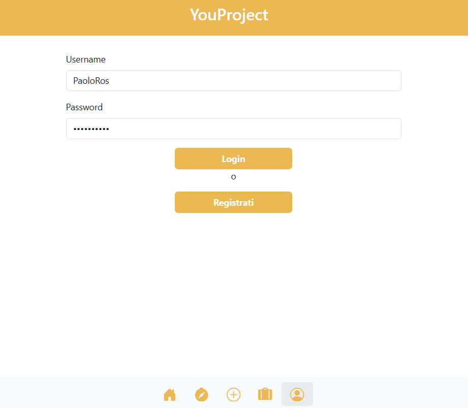
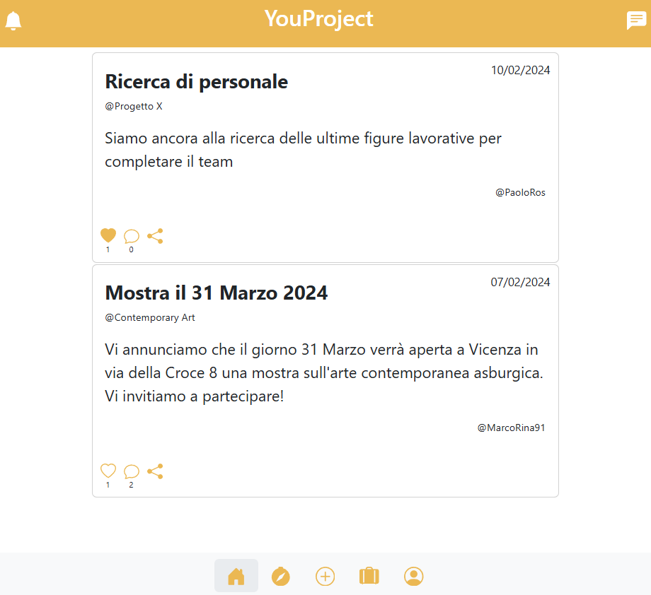
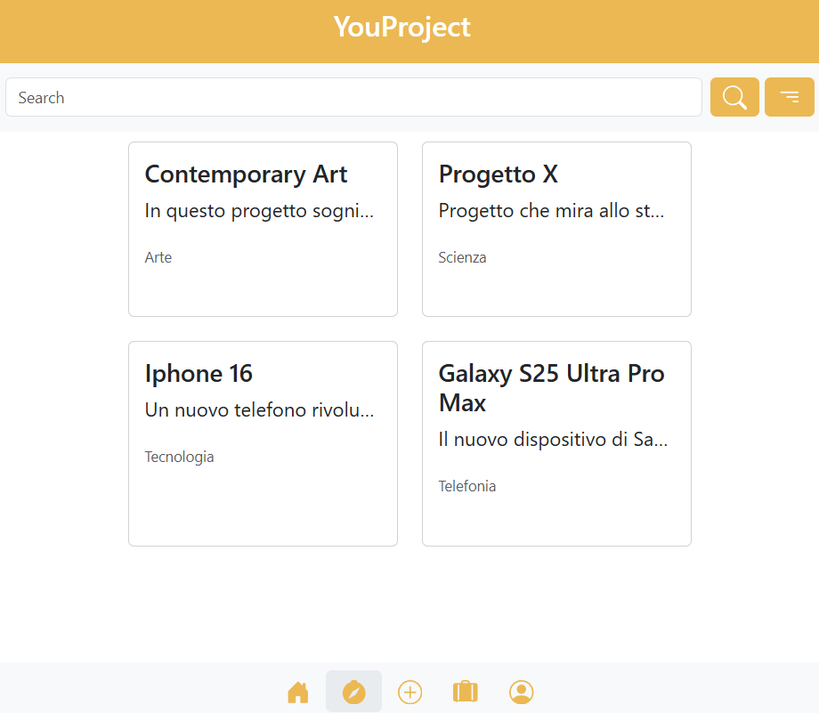

# YouProject - Application Development

## Introduction

YouProject is a university project created with the aim of learning and implementing modern technologies such as **Node.js**, **React**, and **MongoDB**. This project is for educational purposes only, focusing on gaining practical experience in full-stack web application development. The application provides features like user management, project creation and sharing, and news updates, simulating a collaborative environment where users can create and follow projects. I've worked in a group, so I didn't do everything.

## Key Features

- **User Management**: Registration, authentication, and profile management.
- **Project Management**: Creation, modification, and sharing of projects.
- **Collaboration**: Support projects, add collaborators, and interact through comments.
- **Project News**: Create and view news updates related to projects.
- **Project Support**: Simulate project support through donations (PayPal integration).
- **Explore Projects**: Search and explore projects that users are not yet following.

## Technologies Used

- **Frontend**:
  - React
  - Bootstrap for styling and icons
  - Axios for handling HTTP requests
- **Backend**:
  - Node.js with Express.js
  - MongoDB for database management
  - Multer for file uploads
  - JSON Web Tokens (JWT) for authentication

## Showcase

## Requirements

- **Node.js** version 14+
- **MongoDB** (local or on MongoDB Atlas)
- **npm** version 6+
